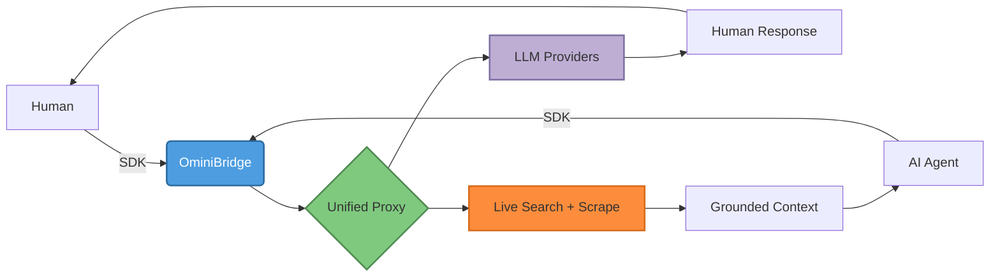

<div align="center">

# 🌉 OminiBridge

```text
  ____   ____  ____  _   __ ____  ____  ____  ___   ____  _____
 / __ \ / __ \/  _/ / | / //  _/ / __ \/ __ \/   | / __ \/ ___/
 / /_/ // /_/ // /  /  |/ / / /  / /_/ / /_/ / /| |/ /_/ /\__ \
 \____/ \____/___/ / /|  /_/___/  \____/_____/_/ |_/ .___/___/ /
                    /_/                          /_/
```

**One API to Rule Them All.**

_Seamlessly bridging the gap between human ingenuity and autonomous AI intelligence._

[](https://git.io/typing-svg)


</div>

---

## ✨ What Makes OminiBridge Special

OminiBridge is an ultra-lightweight, open-source **proxy abstraction layer** that unifies top AI models, services, and live search engines into a single, context-aware API. 

<div align="center">

| 🎯 **Human-First** | 🤖 **Agent-Native** | 🔍 **Live Search** | 🛡️ **Enterprise-Grade Security** |
|---|---|---|---|
| Clean, predictable APIs for developers | `agent_mode` with JSON-structured responses | Serper + DuckDuckGo fallback with smart caching | SSRF-hardened scraping with DNS/IP validation |

</div>

---

## 🎬 Animated Overview

<div align="center">



</div>

---

## 📂 Repository Architecture

| Package | Purpose | Tech |
|---|---|---|
| [`packages/core-api`](./packages/core-api) | High-performance Hono-based unified proxy server | TypeScript + Hono |
| [`packages/sdk-ts`](./packages/sdk-ts) | Universal JavaScript/TypeScript client library | TypeScript |
| [`packages/sdk-python`](./packages/sdk-python) | Agent-first Python client library | Python |
| [`packages/dashboard`](./packages/dashboard) | Static admin UI stub (GitHub OAuth) | Vanilla/Static |

See [USE_CASES.md](./USE_CASES.md) for practical scenarios, architectural comparisons, examples, and current limitations.

---

## 🚀 Quickstart

### 1. Core API Server Setup

Spin up the unified proxy in seconds:

```bash
cd packages/core-api
npm install
AUTH_MODE=development npm run dev
```

🎉 Server now running at `http://localhost:3000`!

`AUTH_MODE=development` is an explicit local-only auth bypass. The default
`AUTH_MODE=required` protects `/v1/*` and requires a configured PostgreSQL key
store; never run the development bypass on a reachable deployment.

### 2. Environment Configuration

Configure credentials for live functionality:

| Variable | Required | What it does |
|---|---|---|
| `OPENAI_API_KEYS` | Optional | Comma-separated OpenAI keys for **round-robin routing + auto-failover** |
| `OPENAI_API_KEY` | Optional | Single OpenAI key fallback |
| `SERPER_API_KEY` | Optional | Enables Serper primary search. Falls back to DuckDuckGo HTML if missing/failed |
| `PORT` | Optional | Custom port (defaults to `3000`) |
| `AUTH_MODE` | Optional | `required` (default) enforces tenant API keys; `development` explicitly bypasses auth for local-only use |
| `DATABASE_URL` | Required for authenticated API use | PostgreSQL connection string for tenant and API-key metadata |
| `REDIS_URL` | Required for authenticated API use | Redis connection string for atomic shared tenant rate limits |
| `RATE_LIMIT_MAX_REQUESTS` | Optional | Requests per tenant per window (default `60`) |
| `RATE_LIMIT_WINDOW_MS` | Optional | Fixed-window duration in milliseconds (default `60000`) |
| `METRICS_TOKEN` | Optional | Enables the authenticated Prometheus `/metrics` endpoint; keep it private |
| `SEARCH_CACHE_BACKEND` | Optional | `redis` for authenticated deployments; `memory` for local development |
| `SEARCH_CACHE_FAILURE_MODE` | Optional | `bypass` (default) lets search continue during cache errors; `fail` returns `503` |
| `OTEL_EXPORTER_OTLP_ENDPOINT` | Optional | Enables OpenTelemetry trace export to an OTLP/HTTP collector; defaults to `<endpoint>/v1/traces` |
| `OTEL_EXPORTER_OTLP_TRACES_ENDPOINT` | Optional | Trace-specific OTLP/HTTP endpoint; takes precedence over the general endpoint |
| `OTEL_SERVICE_NAME` | Optional | OpenTelemetry service name (default `omnibridge-core-api`) |
| `OTEL_TRACES_SAMPLER` / `OTEL_TRACES_SAMPLER_ARG` | Optional | Standard OpenTelemetry SDK sampling configuration |

> **Local development:** Set `AUTH_MODE=development` to run without a database or tenant key. Chat can still run in simulated mode when no upstream keys are configured.

### Authenticated API setup

For production-like use, apply the schema migration and create a tenant key
using the operator-only CLI. The database connection must be restricted to
trusted operators; the key is printed once and never stored in plaintext.

```bash
export DATABASE_URL='postgresql://...'
export REDIS_URL='redis://...'
psql "$DATABASE_URL" -v ON_ERROR_STOP=1 \
  -f packages/core-api/migrations/001_tenant_api_keys.sql
psql "$DATABASE_URL" -v ON_ERROR_STOP=1 \
  -f packages/core-api/migrations/002_shared_limits_and_usage.sql
psql "$DATABASE_URL" -v ON_ERROR_STOP=1 \
  -f packages/core-api/migrations/003_monthly_request_budgets.sql
npm run keys --workspace @omnibridge/core-api -- create \
  --tenant example --name app --scopes chat:complete,search:read
```

Copy the generated key into the client configuration. To review metadata or
revoke a key, run:

```bash
npm run keys --workspace @omnibridge/core-api -- list --tenant example
npm run keys --workspace @omnibridge/core-api -- revoke --prefix omni_live_XXXXXXXXXXXX
npm run keys --workspace @omnibridge/core-api -- set-budget \
  --tenant example --requests 10000
```

Plaintext keys cannot be retrieved after creation; create a replacement key to
rotate. Authenticated requests share a Redis fixed-window limit per tenant and
are recorded in PostgreSQL with request ID, operation, response status, and
duration. The optional per-tenant monthly budget counts successful (2xx)
operations in UTC calendar months; validation errors, rate-limit rejections,
and upstream failures do not consume a successful-request slot. The default
budget is unlimited. Set `--requests unlimited` to remove a tenant's budget.
Prompts, authorization headers, and API keys are not included in usage records.
Redis or usage-store failure rejects protected calls rather than silently
bypassing controls.

### Distributed tracing

Set `OTEL_EXPORTER_OTLP_ENDPOINT` or `OTEL_EXPORTER_OTLP_TRACES_ENDPOINT` to
enable batched OpenTelemetry traces over OTLP/HTTP. With neither endpoint set,
tracing is disabled and the API initializes no tracing middleware, span
processor, or exporter. Incoming W3C `traceparent` context is continued, and
outbound provider/search requests carry the child context. Responses include
`X-Trace-ID` when tracing is active.

Spans contain only bounded route/operation names, HTTP methods, and response
statuses. Request or response bodies, URLs and query strings, authorization
headers, provider credentials, and exception messages are deliberately omitted.
For example, use a collector endpoint and a sampled configuration appropriate
for your traffic. The collector hostname must be reachable from the API
container:

```bash
OTEL_SERVICE_NAME=omnibridge-core-api \
OTEL_EXPORTER_OTLP_ENDPOINT=http://your-collector:4318 \
OTEL_TRACES_SAMPLER=parentbased_traceidratio \
OTEL_TRACES_SAMPLER_ARG=0.1 \
docker compose up --build
```

Set `METRICS_TOKEN` to expose Prometheus request counters and latency
histograms at `/metrics`; scrape it with `Authorization: Bearer
<METRICS_TOKEN>`. The endpoint is disabled (404) when no token is configured
and never includes tenant IDs, prompts, search queries, or credentials.

### Run the production-style stack locally

Docker Compose starts PostgreSQL, Redis, and the API; the API applies pending
database migrations before accepting traffic. Nginx exposes the API through a
local-only reverse proxy.

```bash
POSTGRES_PASSWORD='replace-with-a-local-secret' docker compose up --build -d
curl --fail http://localhost:3000/ready
docker compose exec api node packages/core-api/dist/api-keys.js create \
  --tenant example --name app --scopes chat:complete,search:read
```

Scale the API behind the proxy with `docker compose up --scale api=2 -d`.
Redis-backed limits and search cache, along with PostgreSQL keys and usage,
remain shared across the replicas. For operator commands with multiple API
containers, select one explicitly, for example:
`docker compose exec --index 1 api node packages/core-api/dist/api-keys.js list --tenant example`.

The Compose ports bind to localhost. Its default PostgreSQL password is only
for disposable local development—set `POSTGRES_PASSWORD` explicitly and use
managed credentials, TLS, backups, and network policy for deployed
environments. Stop the stack with `docker compose down`; the PostgreSQL volume
is retained unless explicitly removed.

Back up the durable control and usage data with:

```bash
docker compose exec -T postgres pg_dump -U omnibridge omnibridge > omnibridge.sql
```

Restore a dump to a clean database before pointing the service at it:

```bash
docker compose exec -T postgres createdb -U omnibridge omnibridge_restore
cat omnibridge.sql | docker compose exec -T postgres \
  psql -v ON_ERROR_STOP=1 --single-transaction -U omnibridge -d omnibridge_restore
```

Backups contain API-key hashes and usage data: encrypt them, store them outside
the container host with access controls, and test restores regularly. Redis
contains only rebuildable rate-limit and cache state; it is not a substitute
for PostgreSQL backups.

### 3. SDK Usage Examples

#### TypeScript (For Human Developers)

```typescript
import { OmniBridge } from '@omnibridge/sdk';

const omni = new OmniBridge({
  apiKey: process.env.OMNIBRIDGE_API_KEY!,
  baseUrl: 'http://localhost:3000'
});

// Complete with any provider
const response = await omni.complete({
  provider: 'openai',
  messages: [{ role: 'user', content: 'Generate a concise project summary.' }],
  agentMode: false
});

console.log(response);
```

#### Python (For AI Agents & Automated Runtimes)

```python
import os
from omnibridge import OmniBridge

omni = OmniBridge(api_key=os.environ["OMNIBRIDGE_API_KEY"], base_url="http://localhost:3000")

# Elevate to agent_mode=True for structured JSON alignment
response = omni.complete(
    provider="openai",
    messages=[{"role": "user", "content": "Analyze system architecture."}],
    agent_mode=True
)

print(response)
```

#### Live Search + Grounding

```typescript
const searchResponse = await omni.search({
  query: "Top open-source AI repositories 2026",
  engine: "google",
  maxResults: 5
});

console.log(searchResponse.results);
```

---

## ⚡ Key Features

<div align="center">

| Feature | Description |
|---|---|
| **🔄 Round-Robin + Failover** | Automatic rotation across multiple OpenAI API keys with graceful fallback |
| **🤖 Dual Identity Model** | `human` vs `agent` modes with agent-specific JSON enforcement via `response_format` |
| **🎯 Smart Caching** | SHA-256 hashed search results cached in-memory for 10 minutes |
| **🛡️ SSRF-Hardened** | DNS + IP validation blocks private/internal hosts, redirects disabled, 1MB cap |
| **📄 HTML → Markdown** | Clean, readable Markdown extraction from scraped pages |
| **🔌 Unified Interface** | Same API shape across TypeScript, Python, and REST |
| **⚡ Zero Bloat** | Minimal, fast, and dependency-light (built on Hono) |
| **🧪 Battle-Tested** | Includes full integration test pipeline |

</div>

---

## 🔍 How It Works

<div align="center">

```text
┌─────────────────┐
│  Your App/Agent │
└────────┬────────┘
         │  1. Single SDK Call
         ▼
┌─────────────────┐
│  OminiBridge    │
│  Unified API    │
└────────┬────────┘
         │  2. Smart Routing
         ▼
    ┌────┴───────────────────────────────────┐
    │                                       │
┌───▼────────┐                    ┌────────▼─────────┐
│ LLM Layer │                    │ Search Layer     │
│ • OpenAI   │                    │ • Serper (Primary)│
│ • Extensible│                   │ • DDG (Fallback) │
│ • JSON Mode│                    │ • SSRF-Safe Scrape│
└────────────┘                    └──────────────────┘
```

</div>

---

## 🧪 Test It Locally

Run the full integration testing matrix:

```bash
npx tsx test-pipeline.ts
```

Validates:
1. ✅ Human mode completions (`identity: human`)
2. ✅ Agent mode completions (`identity: agent`)  
3. ✅ Unified search with engine selection & results

---

## 📚 Documentation

- 📖 **[Complete Context](./CONTEXT.md)** — Deep architecture, security, internals & AI agent guidance
- 📄 **[LICENSE](./LICENSE)** — MIT License

---

## 💫 Development Workflow

```bash
# Install deps (workspace)
npm install

# Run Core API in dev (watch mode)
cd packages/core-api && npm run dev

# Build TypeScript SDK
cd packages/sdk-ts && npx tsc

# Build Core API
cd packages/core-api && npx tsc

# Install Python SDK in editable mode
cd packages/sdk-python && pip install -e .

# Run smoke tests
npx tsx test-pipeline.ts
```

---

## 🗺️ Roadmap

- [ ] Production Gateway Foundation: tenant-aware auth, shared quotas and cache,
  durable usage, and a PostgreSQL + Redis deployment
- [ ] Multi-provider expansion with per-provider key configuration
- [ ] Persistent dashboard backend (auth + key management)
- [ ] Response caching by request hash
- [ ] Streaming passthrough (`stream: true`)
- [ ] Structured search parsing & fully typed results
- [ ] Zod request validation
- [ ] Observability (logs, metrics, tracing)

See the [Production Gateway Foundation proposal](./PROPOSALS/production-gateway-foundation.md)
for the rationale, security requirements, and phased delivery plan.

---

<div align="center">

### Built with ❤️ by [Mohammed Alwali Yunusa](https://github.com/asymalwali)

_"Build By Asym Alwali Cheers 🥂"_

**⚡ Bridging Intent • Grounding Context • Powering Agents ⚡**

[](https://github.com/asymalwali/OminiBridge)
[](https://github.com/asymalwali/OminiBridge)

</div>
