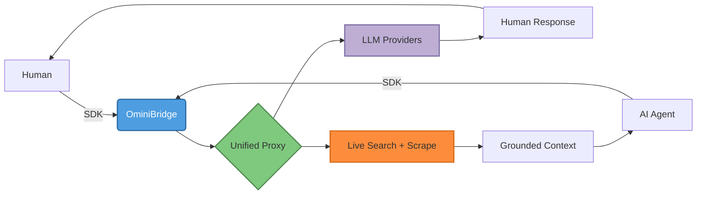

<div align="center">

# 🌉 OminiBridge

```text
  ____   ____  ____  _   __ ____  ____  ____  ___   ____  _____
 / __ \ / __ \/  _/ / | / //  _/ / __ \/ __ \/   | / __ \/ ___/
 / /_/ // /_/ // /  /  |/ / / /  / /_/ / /_/ / /| |/ /_/ /\__ \
 \____/ \____/___/ / /|  /_/___/  \____/_____/_/ |_/ .___/___/ /
                    /_/                          /_/
```

**One API to Rule Them All.**

_Seamlessly bridging the gap between human ingenuity and autonomous AI intelligence._

[](https://git.io/typing-svg)


</div>

---

## ✨ What Makes OminiBridge Special

OminiBridge is an ultra-lightweight, open-source **proxy abstraction layer** that unifies top AI models, services, and live search engines into a single, context-aware API. 

<div align="center">

| 🎯 **Human-First** | 🤖 **Agent-Native** | 🔍 **Live Search** | 🛡️ **Enterprise-Grade Security** |
|---|---|---|---|
| Clean, predictable APIs for developers | `agent_mode` with JSON-structured responses | Serper + DuckDuckGo fallback with smart caching | SSRF-hardened scraping with DNS/IP validation |

</div>

---

## 🎬 Animated Overview

<div align="center">



</div>

---

## 📂 Repository Architecture

| Package | Purpose | Tech |
|---|---|---|
| [`packages/core-api`](./packages/core-api) | High-performance Hono-based unified proxy server | TypeScript + Hono |
| [`packages/sdk-ts`](./packages/sdk-ts) | Universal JavaScript/TypeScript client library | TypeScript |
| [`packages/sdk-python`](./packages/sdk-python) | Agent-first Python client library | Python |
| [`packages/dashboard`](./packages/dashboard) | Static admin UI stub (GitHub OAuth) | Vanilla/Static |

---

## 🚀 Quickstart

### 1. Core API Server Setup

Spin up the unified proxy in seconds:

```bash
cd packages/core-api
npm install
npm run dev
```

🎉 Server now running at `http://localhost:3000`!

### 2. Environment Configuration

Configure credentials for live functionality:

| Variable | Required | What it does |
|---|---|---|
| `OPENAI_API_KEYS` | Optional | Comma-separated OpenAI keys for **round-robin routing + auto-failover** |
| `OPENAI_API_KEY` | Optional | Single OpenAI key fallback |
| `SERPER_API_KEY` | Optional | Enables Serper primary search. Falls back to DuckDuckGo HTML if missing/failed |
| `PORT` | Optional | Custom port (defaults to `3000`) |

> **Pro Tip:** With no keys configured, OminiBridge runs in **simulated mode** perfect for local development and testing!

### 3. SDK Usage Examples

#### TypeScript (For Human Developers)

```typescript
import { OmniBridge } from '@omnibridge/sdk';

const omni = new OmniBridge({ 
  apiKey: 'OMNI_KEY_SECRET',
  baseUrl: 'http://localhost:3000'
});

// Complete with any provider
const response = await omni.complete({
  provider: 'openai',
  messages: [{ role: 'user', content: 'Generate a concise project summary.' }],
  agentMode: false
});

console.log(response);
```

#### Python (For AI Agents & Automated Runtimes)

```python
from omnibridge import OmniBridge

omni = OmniBridge(api_key="OMNI_KEY_SECRET", base_url="http://localhost:3000")

# Elevate to agent_mode=True for structured JSON alignment
response = omni.complete(
    provider="openai",
    messages=[{"role": "user", "content": "Analyze system architecture."}],
    agent_mode=True
)

print(response)
```

#### Live Search + Grounding

```typescript
const searchResponse = await omni.search({
  query: "Top open-source AI repositories 2026",
  engine: "google",
  maxResults: 5
});

console.log(searchResponse.results);
```

---

## ⚡ Key Features

<div align="center">

| Feature | Description |
|---|---|
| **🔄 Round-Robin + Failover** | Automatic rotation across multiple OpenAI API keys with graceful fallback |
| **🤖 Dual Identity Model** | `human` vs `agent` modes with agent-specific JSON enforcement via `response_format` |
| **🎯 Smart Caching** | SHA-256 hashed search results cached in-memory for 10 minutes |
| **🛡️ SSRF-Hardened** | DNS + IP validation blocks private/internal hosts, redirects disabled, 1MB cap |
| **📄 HTML → Markdown** | Clean, readable Markdown extraction from scraped pages |
| **🔌 Unified Interface** | Same API shape across TypeScript, Python, and REST |
| **⚡ Zero Bloat** | Minimal, fast, and dependency-light (built on Hono) |
| **🧪 Battle-Tested** | Includes full integration test pipeline |

</div>

---

## 🔍 How It Works

<div align="center">

```text
┌─────────────────┐
│  Your App/Agent │
└────────┬────────┘
         │  1. Single SDK Call
         ▼
┌─────────────────┐
│  OminiBridge    │
│  Unified API    │
└────────┬────────┘
         │  2. Smart Routing
         ▼
    ┌────┴───────────────────────────────────┐
    │                                       │
┌───▼────────┐                    ┌────────▼─────────┐
│ LLM Layer │                    │ Search Layer     │
│ • OpenAI   │                    │ • Serper (Primary)│
│ • Extensible│                   │ • DDG (Fallback) │
│ • JSON Mode│                    │ • SSRF-Safe Scrape│
└────────────┘                    └──────────────────┘
```

</div>

---

## 🧪 Test It Locally

Run the full integration testing matrix:

```bash
npx tsx test-pipeline.ts
```

Validates:
1. ✅ Human mode completions (`identity: human`)
2. ✅ Agent mode completions (`identity: agent`)  
3. ✅ Unified search with engine selection & results

---

## 📚 Documentation

- 📖 **[Complete Context](./CONTEXT.md)** — Deep architecture, security, internals & AI agent guidance
- 📄 **[LICENSE](./LICENSE)** — MIT License

---

## 💫 Development Workflow

```bash
# Install deps (workspace)
npm install

# Run Core API in dev (watch mode)
cd packages/core-api && npm run dev

# Build TypeScript SDK
cd packages/sdk-ts && npx tsc

# Build Core API
cd packages/core-api && npx tsc

# Install Python SDK in editable mode
cd packages/sdk-python && pip install -e .

# Run smoke tests
npx tsx test-pipeline.ts
```

---

## 🗺️ Roadmap

- [ ] Multi-provider expansion with per-provider key configuration
- [ ] Persistent dashboard backend (auth + key management)
- [ ] Rate limiting + proxy-level API key authentication
- [ ] Response caching by request hash
- [ ] Streaming passthrough (`stream: true`)
- [ ] Structured search parsing & fully typed results
- [ ] Zod request validation
- [ ] Observability (logs, metrics, tracing)
- [ ] Docker + Docker Compose support
- [ ] Typed error contracts across all SDKs

---

<div align="center">

### Built with ❤️ by [Mohammed Alwali Yunusa](https://github.com/asymalwali)

_"Build By Asym Alwali Cheers 🥂"_

**⚡ Bridging Intent • Grounding Context • Powering Agents ⚡**

[](https://github.com/asymalwali/OminiBridge)
[](https://github.com/asymalwali/OminiBridge)

</div>
